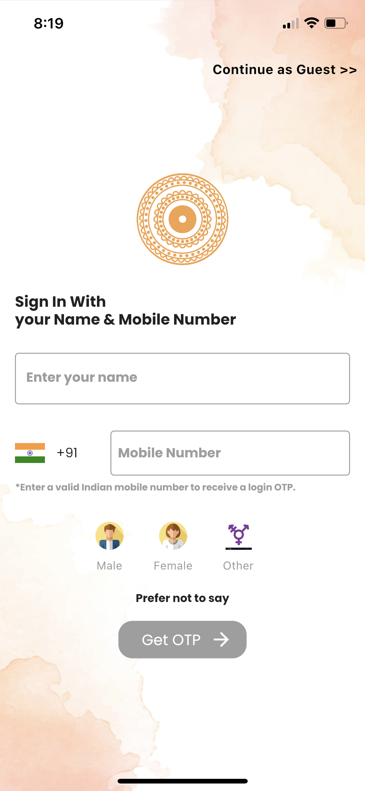
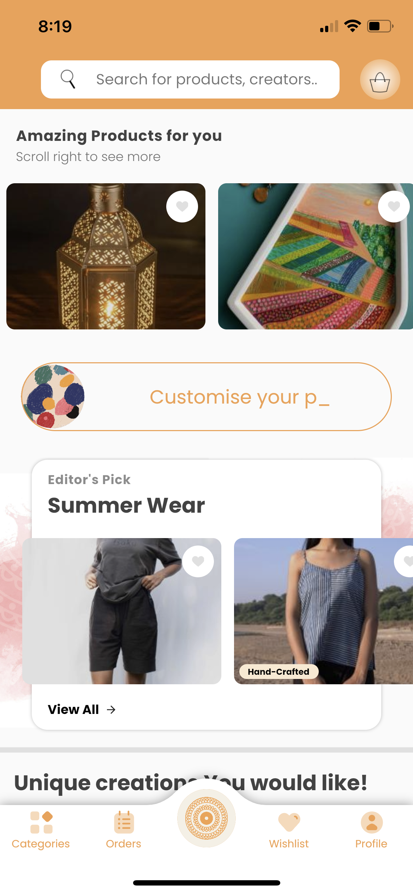
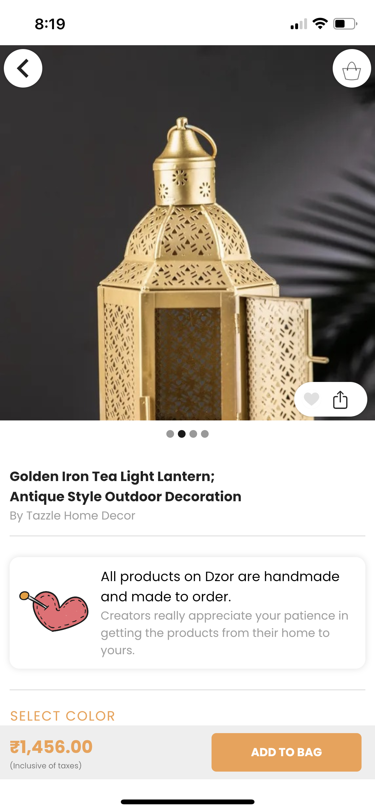
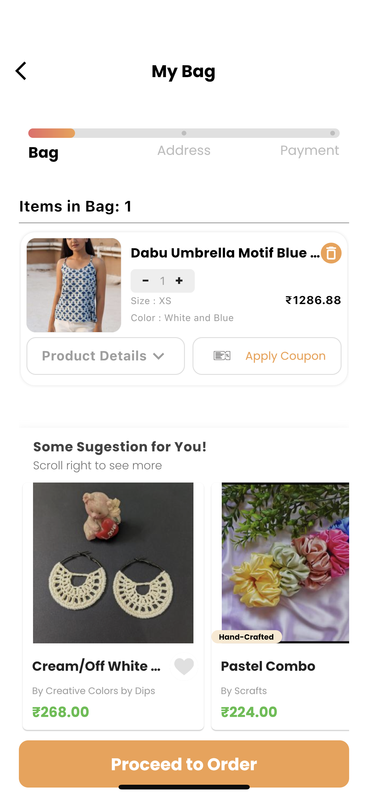
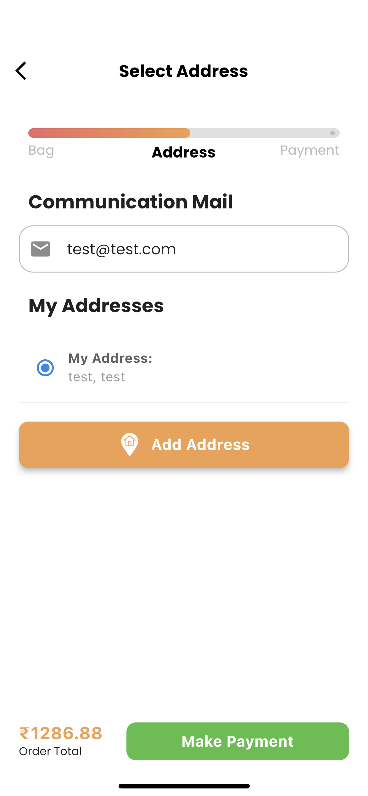
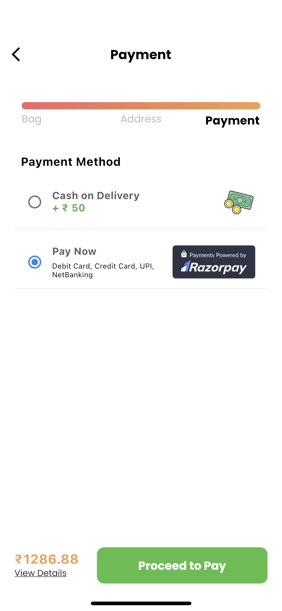
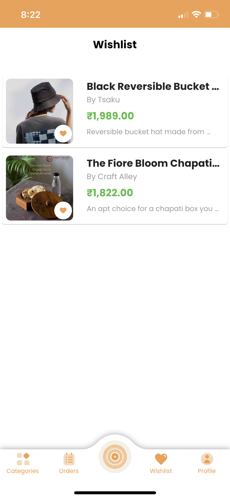

<p align="center">
  <a>
    
  </a>
  <h1 align="center">Handmade & Precious - Flutter</h1>  
</p>

---

## Introduction

**Handmade & Precious** is an ecommerce app made with Flutter using server function and realm database.

---

## :sparkles: Main Features

- Authentication.
- Add items to your whishlist
- Search Products
- Infinite list (Pagination)
- Sort with category
- Profile 
- Order
- Demo Payment Gateway

### Android

You can download the latest APK [here](https://drive.google.com/file/d/1y5Lo0RLvn_vDk8vTn3kf69d4_CNrqBWz/view?usp=sharing).

### IOS

Please clone the repo 🙃🙃🙃

## :camera_flash: Screenshots

<div align="center" style="margin:auto;width:100%;display:flex;justify-content:center;align-items:center;flex-wrap:wrap;">







</div>

## Development

```js bash
# Dependencies
Flutter pub get


# Run 
flutter run
